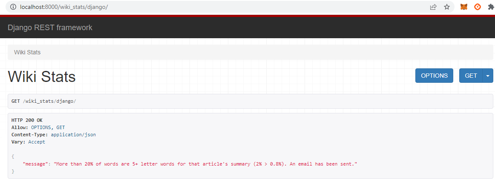

<h2>Big Word Search project</h2>

<h4>Requirements</h4> 
1. Install project dependencies mentioned in requirements.txt
 
2. Complete email parameters in settings.py, following the documentation : https://docs.djangoproject.com/en/3.2/topics/email/
Beware your email address is properly configured to send django emails, see this tutorial : https://www.sitepoint.com/django-send-email/
By default, settings.py proposes gmail smtp.

<h4>Steps to run Django server</h4>  
1. Source the project environment : <i>$ source venv/Scripts/activate</i>
 
2. Execute <i>$python manage.py runserver</i>

<h4>How does the project work</h4> 
- You need to indicate the Wikipedia's article title directly on this url: <b>localhost:8000/wiki_stats/< title ></b>
 
- The API view shows the result of services.py functions within the {"message":"..."} alert object.
For example, searching "Django" title would render this view :

 
- I invite you to look at comments to understand how I organized the code.
 
- And play with tests.py file (<em>python -m unittest tests.py</em>).

